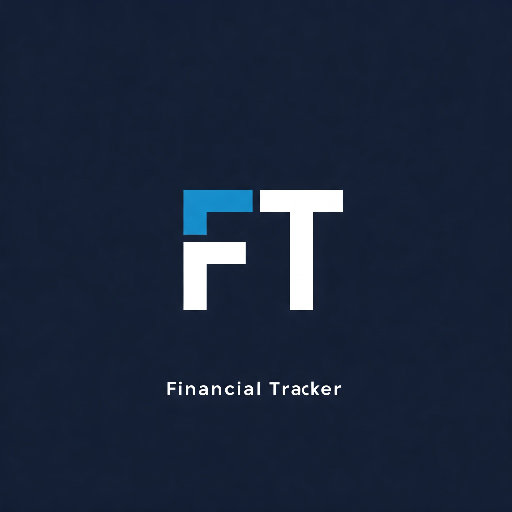
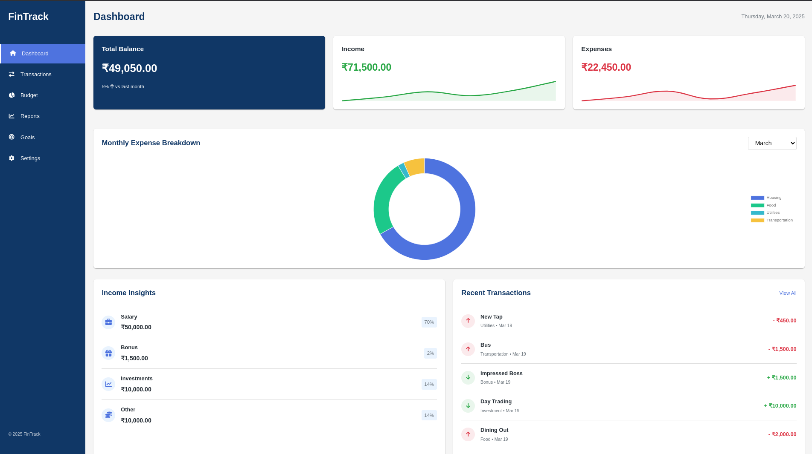
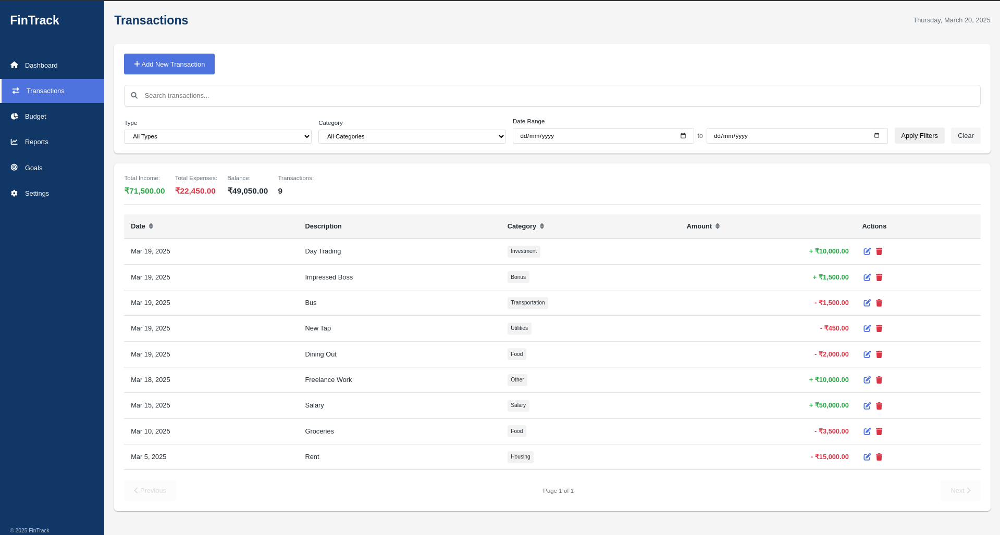
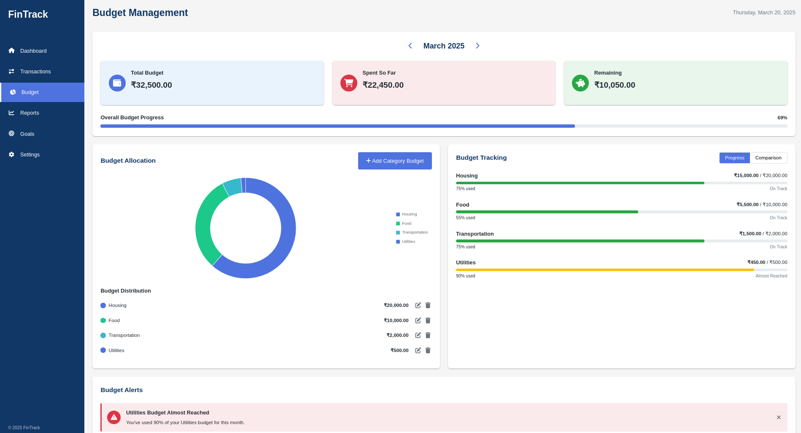
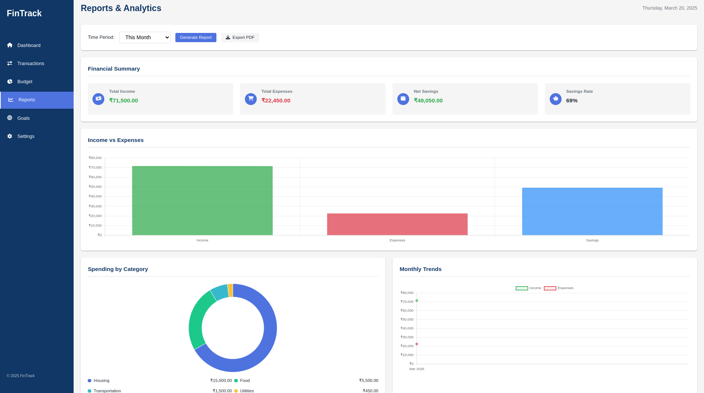
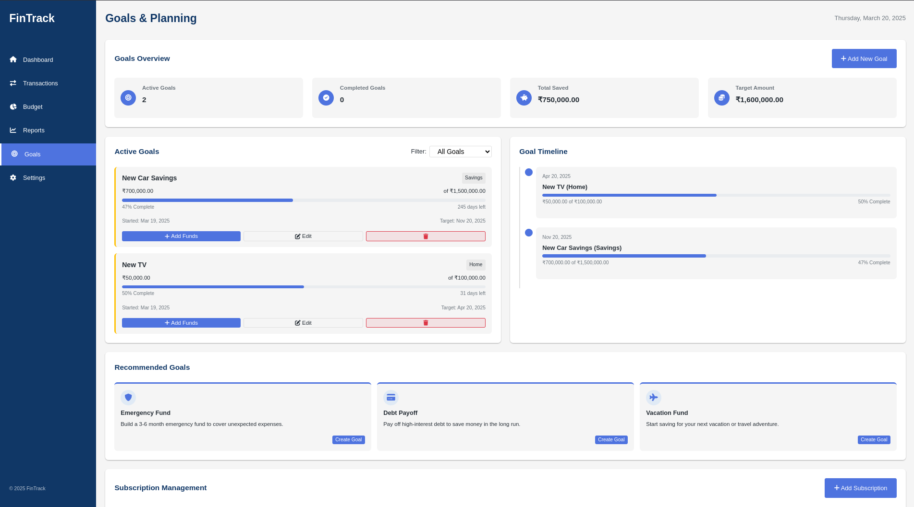

# FinTrack - Personal Finance Manager

**_FinTrack_** is a comprehensive personal finance management web application built with **HTML**, **CSS**, and **JavaScript**. It empowers users to *track expenses*, *manage budgets*, *set financial goals*, and *gain insights* into their spending habits.



## Features

### Dashboard
- **_Total Balance Overview_**: Real-time summary of all accounts
- **_Monthly Expense Tracking_**: Visual breakdown of spending
- **_Income Insights_**: Breakdown of salary, bonuses, and other income
- **_Recent Transactions_**: Quick view of latest activity
- **_Budget Progress_**: Visualization of budget status
- **_Financial Health Indicators_**: Key metrics for financial wellness

### Transactions
- **_Transaction History_**: Complete log with filtering options
- **_Categorization_**: Automatic and manual tagging
- **_Search Functionality_**: Free text search for transactions
- **_Manual Entry_**: Form to add transactions
- **_Edit/Delete Options_**: Modify or remove entries
- **_Sorting_**: By date, amount, or category

### Budget Management
- **_Monthly Budget Setup_**: Define and track budgets
- **_Category Allocation_**: Assign budgets to specific categories
- **_Budget vs. Actual_**: Compare planned vs. real spending
- **_Progress Indicators_**: Visual cues for budget status
- **_Overspending Alerts_**: Notifications for exceeding limits

### Reports & Analytics
- **_Spending by Category_**: Visual breakdown of expenses
- **_Income vs. Expense_**: Comparative analysis
- **_Monthly Trends_**: Insights into spending patterns
- **_Custom Date Range_**: Flexible report generation
- **_Exportable Reports_**: Downloadable in PDF format

### Goals & Planning
- **_Goal Creation_**: Set and track financial objectives
- **_Timeline Visualization_**: See progress over time
- **_Milestone Tracking_**: Monitor key achievements
- **_Goal Recommendations_**: Suggestions based on habits
- **_Subscription Management_**: Auto-renewal tracking

### Settings
- **_Category Management_**: Add, edit, or delete categories
- **_Currency Selection_**: Choose preferred currency
- **_Theme Customization_**: Light or dark mode options
- **_Color Accents_**: Personalize the interface
- **_Data Options_**: Import/export functionality

## Technologies Used
- **_HTML5_**: Structure and content
- **_CSS3_**: Styling and layout
- **_JavaScript (ES6+)_**: Functionality and interactivity
- **_Chart.js_**: Data visualization
- **_jsPDF_**: Report generation
- **_localStorage_**: Data persistence

# FinTrack - Personal Finance Manager

**FinTrack** is a comprehensive personal finance management web application built with **HTML**, **CSS**, and **JavaScript**. It helps you track expenses, manage budgets, set financial goals, and gain insights into your spending habits.


---

## Features

- **Dashboard**
  - *Total Balance Overview*: Real-time summary of all accounts.
  - *Monthly Expense Tracking*: Visual breakdown of monthly expenses.
  - *Income Insights*: Detailed view of salary, bonuses, and other income.
  - *Recent Transactions*: Quick view of your latest financial activities.
  - *Budget Progress*: Visual indicators comparing budget vs. actual spending.
  - *Financial Health*: Monitor overall financial well-being.

- **Transactions**
  - Complete transaction history with filtering options.
  - Automatic and manual transaction categorization.
  - Free text search functionality.
  - Manual transaction entry form.
  - Edit/delete transaction capabilities.
  - Sorting by date, amount, or category.

- **Budget Management**
  - Monthly budget setup and tracking.
  - Category-specific budget allocation.
  - Budget vs. actual spending comparisons.
  - Visual progress indicators.
  - Budget alerts for overspending.

- **Reports & Analytics**
  - Spending by category visualization.
  - Income vs. expense comparisons.
  - Monthly trends analysis.
  - Customizable date range for reports.
  - Exportable reports (PDF) via jsPDF.

- **Goals & Planning**
  - Financial goal creation and tracking.
  - Timeline visualization for goals.
  - Progress tracking with milestones.
  - Goal recommendations based on spending patterns.
  - Auto-renewal management for subscriptions.

- **Settings**
  - Category management (add/edit/delete).
  - Currency selection.
  - Theme customization (light/dark mode).
  - Color accent customization.
  - Data import/export options.

---

## Project Structure
The project is organized as follows:

```text
/webp-project
  /src
    /css
      style.css
      transactions.css
      budget.css
      reports.css
      goals.css
      settings.css
    /js
      app.js
      storage.js
      ui.js
      transactions.js
      budget.js
      reports.js
      goals.js
      settings.js
      theme-loader.js
    /pages
      transactions.html
      budget.html
      reports.html
      goals.html
      settings.html
      index.html
  /assets
    /icons
      logo.png
  README.md
```


## Installation and Usage

1. Clone the repository:
    git clone https://github.com/yourusername/fintrack.git

2. Open index.html in your web browser to launch the application.

3. No additional installation or setup is required as the application uses localStorage for data persistence.

## Key Features

- **Data Persistence**: All your financial data is stored locally in your browser using localStorage.
- **Responsive Design**: Works on desktop, tablet, and mobile devices.
- **Offline Functionality**: No internet connection required after initial load.
- **Privacy-Focused**: Your financial data never leaves your device.
- **Customizable**: Personalize the app with themes and color accents.

## Screenshots







## Future Enhancements

- Bank account integration
- Cloud synchronization
- Mobile app version
- Advanced investment tracking
- AI-powered financial insights

## Contributing

Contributions are welcome! Please feel free to submit a Pull Request.


## Acknowledgements

- Chart.js for the beautiful charts
- Font Awesome for the icons
- jsPDF for PDF generation capabilities


  
